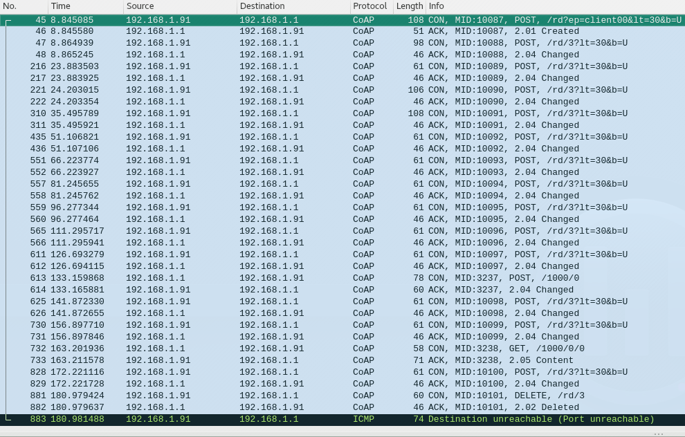
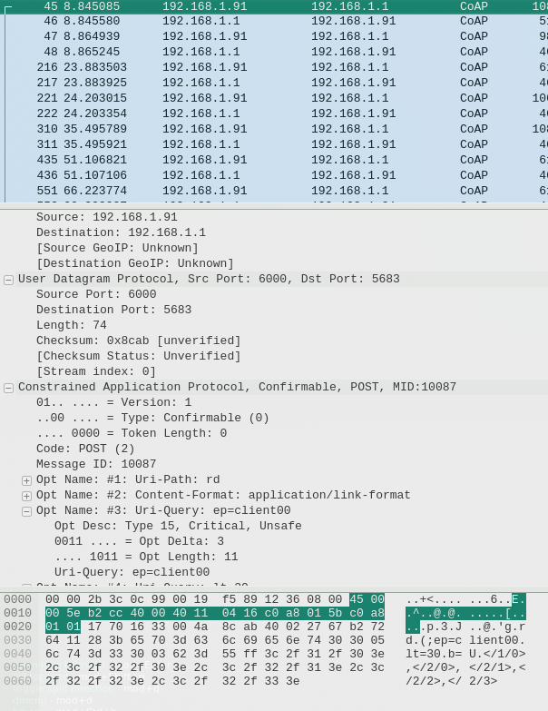
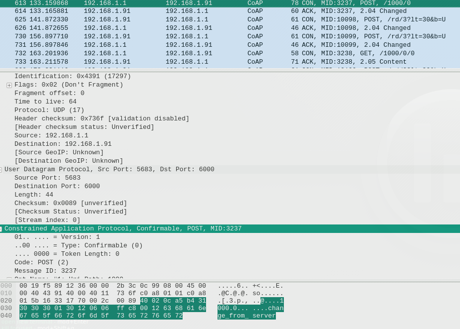
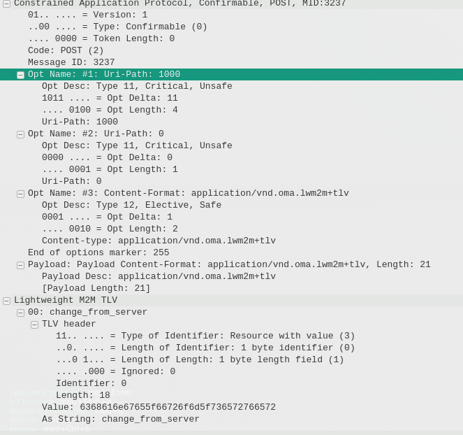
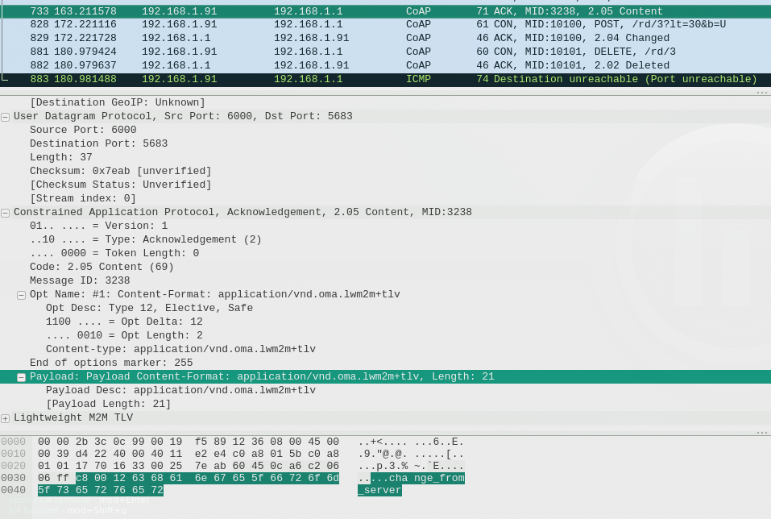

# AWA LWM2M Práctica 4
## Alumnos 
Sergio Semedi Barranco

Lucas Segarra Fernandez

## Memoria

__Utiliza la herramienta awa-client-get para leer el recurso recién creado__

    user-iot@VM-IOT:~/AwaLWM2M/build/tools$ ./awa-client-get /1000
    Heater[/1000/0]:
         Manufacturer[/1000/0/101]: HotAir Systems Inc

__Actualiza el código con las anteriores modificaciones y, además, añade una nueva
función UpdateTemperature() que acepte un valor de temperatura en punto flo-
tante y lo escriba en el nuevo recurso. Añade también un bucle while en la función
main que acepte valores de temperatura proporcionados por consola (para simular
valores reales de un dispositivo, por ejemplo), y use la función creada para actuali-
zar el recurso.__

RP2_AWA
Añadimos primero mediante código el nuevo recurso del que dispondra el objeto
(temperature):

    user-iot@VM-IOT:~/AwaLWM2M/build/tools$ ./awa-client-get /1000
    Heater[/1000/0]:
         Manufacturer[/1000/0/101]: HotAir Systems Inc
        Temperature[/1000/0/104]: 0

__Usa la herramienta awa-server-list-clients para comprobar que el cliente está correc-
tamente registrado con el servidor (busca el objeto /1000/0
). ¿Cuál es la salida de dicho programa con la opción -objects ?__

    _client: client1
      /1/0     LWM2MServer
      /2/0     LWM2MAccessControl
      /2/1     LWM2MAccessControl
      /2/2     LWM2MAccessControl
      /2/3     LWM2MAccessControl
      /1000/0 Unknown
      /1001 Unknown
      /1004 Unknown
      /1005 Unknown_

El cliente esta correctamente registrado pero el objeto /1000 no esta correctamente registrado.
procedemos a su registro:

Utilizando la herramienta awa-server-define:

    _user-iot@VM-IOT:~$ awa-server-list-clients -o
    Client: client00
      /1/0     LWM2MServer
      /2/0     LWM2MAccessControl
      /2/1     LWM2MAccessControl
      /2/2     LWM2MAccessControl
      /2/3     LWM2MAccessControl
      /1000/0  object_test

Como podemos ver, podemos comprobar que nuestro objeto /1000 esta definido.

__Por último, lee desde el nuevo recurso utilizando la herramienta de servidor awa-
server-read y muestra la salida. De forma alternativa, es posible leer objetos comple-
tos e instancias de objetos. ¿Cuál sería en este caso la orden a ejecutar y la salida
correspondiente?__

Ejecutaría:

    awa-server-read -c client00 /1000

    object_test[/1000/0]:
        res0[/1000/0/0]:

Ahora además vamos a cambiar ese valor desde el servidor:

    awa-server-write -c client00 /1000/0/0=prueba
    awa-server-read -c client00 /1000

    object_test[/1000/0]:
        res0[/1000/0/0]: prueba
        
        
## Testing AWA

Para probar el comportamiento del protocolo, hemos conectado la ci40 a nuestro ordenador (MV) para poder realizar las pruebas.
La arquitectura quedaría de la siguiente manera:

Maquina Virtual, Ubuntu, coap_serverd <--------> ci40, openWrt, coap_clientd (client00)

Para realizar las pruebas hemos decidido, realizar unas operaciones básicas:

* Serverd en maquina virtual se inicia escuchando en la interfaz de red apropiada
* clientd en ci40 con fichero bootstrap que apunta hacia la maquina virtual
* Registro de un nuevo objeto 1000 en el cliente
* Instancia de el objeto 1000 e instancia de su único recurso
* Comprabacion MV del registro del nuevo cliente
* cambio del recurso del objeto 1000 desde el servidor
* Lectura del objeto 1000 desde el servidor
* Fin de la conexión

### analisis y screens

Realizando la prueba hemos procedido a la captura de paquetes de la conexión cliente servidor.

Como primer dato técnico, sabemos que Coap actua sobre udp, siendo este el protocolo usado para la comunicación por el puerto por defecto de coap.

Una vez estamos analizando la conexión si filtramos por udp obtenemos las siguientes conexiones:

Lo primero que hemos hecho ha sido esperar al correspondiente registro del cliente, este es un demonio que intenta buscar un servidor en el que registrarse, en nuestro caso lo obtendra del fichero bootstrap:

Aquí podemos comprobar como la ci40 (192.168.1.91) envia una peticion CON (UDP) en el que esta anunciandole al servidor su nombre: client00 y los objetos que ya tiene definidos en su formato normal.

El cliente ya se encuentra registrado, y el servidor sabe de su existencia.
Si llegados a este punto empezamos a crear instances en el cliente el servidor sabrá de su existencia con el continuo intercambio de mensajes.

Vamos a observar ahora que es lo que sucede si queremos cambiar el valor de un registro desde el servidor:

El servidor envia la peticion indicando el valor del recurso a cambiar, en nuestro caso estamos accediendo a /100/0/0 y cambiando su valor a change_from server.

Aquí podemos comprobar el contenido de la petición, podemos observar que se indica todo, la ruta del objeto, el recurso y su valor.

Por último el servidor espera el ack recibido por el cliente:

Para concluir el estudio añadir que como la comunicación se realiza por UDP, todo se basa en el envio y recepción de CON, ACK.
Los mensajes CON que contienen el contenido son de tipo POST.

